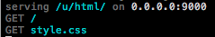

serve
=====

Simple web server for static files with terminal logging.



## Installation

```
go get -u github.com/frozzare/serve
```

## Usage

```bash
$ serve --help
Usage of serve:
	-host="0.0.0.0": Define what TCP host to bind to
	-port=9000: Define what TCP port to bind to
	-root=".": Define the root filesystem path
```